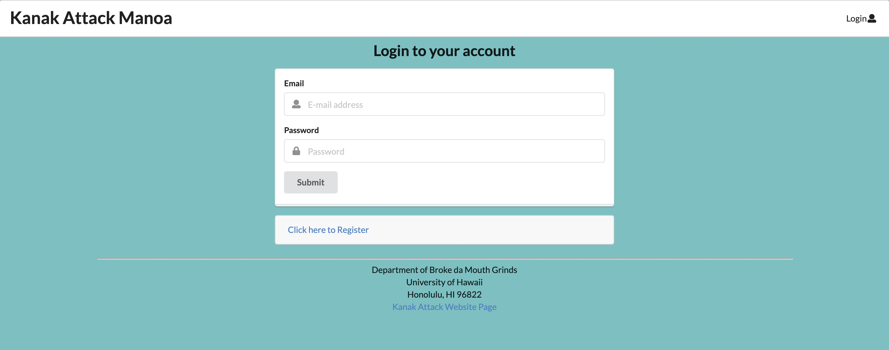
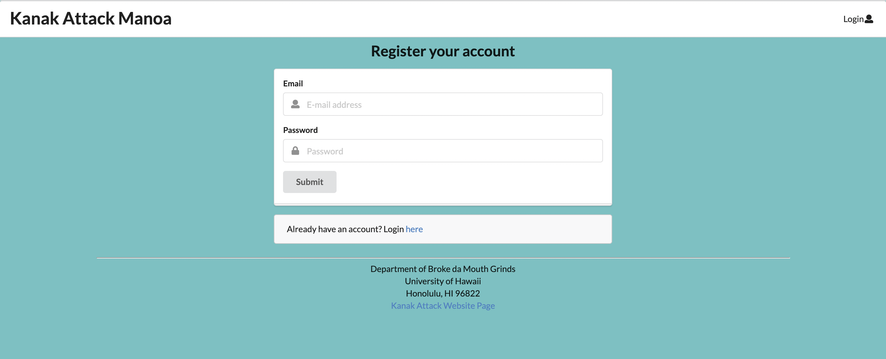
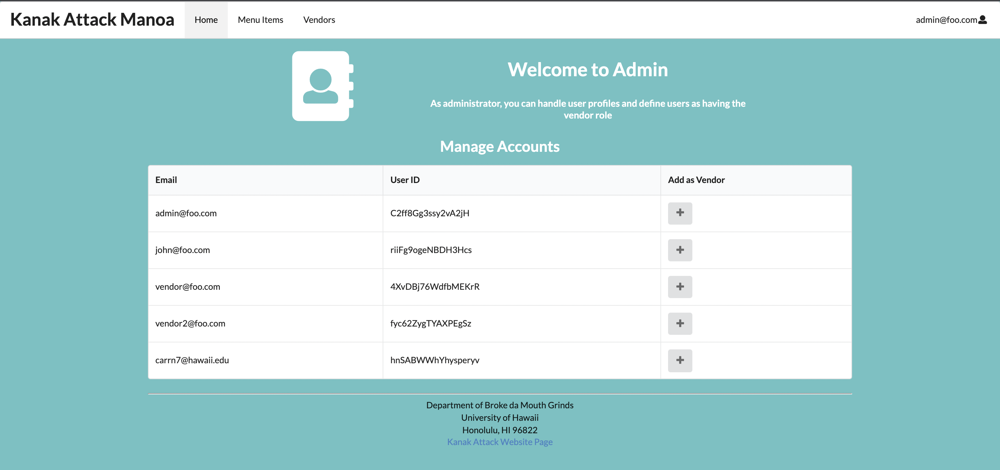
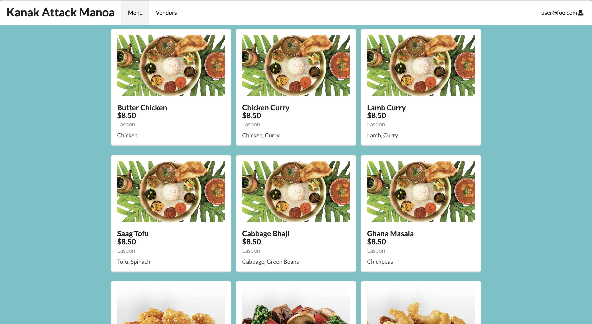

* [Kanak Attack Manoa Organization](https://github.com/kanak-attack-manoa)
* [Kanak Attack Manoa](https://github.com/kanak-attack-manoa/kanak-attack-manoa)

## Table of contents
* [Overview](#overview)
* [User Guide](#user-guide)
* [Milestones](#milestones)
* [Developer Guide](#developer-guide)
* [Deployment](#deployment)
* [Team Members](#team-members)

## Overview

Kanak Attack is an app designed for the UH Manoa campus. It gives vendors the ability to maintain an active menu, update special items, and list the availability of items. The items can be sorted by ingredients, cuisine, or availability. The user will have the ability to select what type of cuisine they want. On top of that, they will be able to filter food items by ingredients, type, style. The overall purpose of this app is to display available items around campus so the user can make a decision on what to eat based on their personal taste and availability.

The system should eventually provide the following:

* We will have three user roles (vendor, consumer, and admin) in which the vendors can update the app to include available menu options, changes, or specials.
* Top-level index pages Profiles, Foods, and Places.
* Initialization code to define default Profiles, Foods, and Places and relations between them.
* A simple Filter page where the user will be able to filter the menu items based on their specified food styles.
* We will have certain pages that are public, Profiles, Foods, and Places, while other pages require login, Favorites and  Filter.

## User Guide

This is a user guide for Kanak Attack Manoa and the mockup pages we plan to create.

### Landing Page

When arriving at the landing page, the user has the option to login to an existing account or create a new one. We will also display general information about the app in case the user is contemplating downloading it.

### Index pages (Profiles, Foods, Places)

Kanak Attack provides three public pages that present the contents of the database organized in various ways.

The Profiles page shows all the current defined profiles and their associated Foods and Places:

Landing Page:


List Vendor Page:


Mockup of User Page:


Mockup of Login Page:



Mockup of Signup/Register Page:



Mockup of Admin Home Page:



### Home page

After logging in, you are taken to the home page, which presents a form where you can complete and/or update your personal profile as a vendor or a consumer.

### Add Menu Item

Once a vendor is logged in, the vendor can define new menu items with the Add Menu Item page.


The vendor will also have the ability to edit the Menu Item


### List Menu Item

The user will also be able to see a list of available menu items and who the vendor is.

Mockup of List Menu Item page:



### List Vendor 

This page allows the user to view all available vendors and click on them to view their specific menu. 

### Filter page

The Filter page provides the ability to query the database and display the results in the page. In this case, the query displays all of the Menu items that match one or more of the specified Food Type(s) (i.e. ingredients, styles, etc..).

### Student/Vendor Feedback

We are undecided on how or if we want to implement community feedback on a vendor basis, application basis or both.

## Milestones
* In Milestone 1, we created the landing page, deployed to Digital Ocean, and created four mockup pages. We also have two pages that read/write to the database. Our latest updates have also been deployed to Digital Ocean. (Finished) [M1 Project Board](https://github.com/kanak-attack-manoa/kanak-attack-manoa/projects/1)
* In Milestone 2, we will improve the quality of our application. We plan on implementing a User page, and having our pages read and write from the database. (In progress) [M2 Project Board](https://github.com/kanak-attack-manoa/kanak-attack-manoa/projects/2)

## Developer Guide

### Installation

First, [install Meteor](https://www.meteor.com/install).

Second, go to [Kanak Attack Manoa](https://github.com/kanak-attack-manoa/kanak-attack-manoa), and download a copy of Kanak Attack Manoa.

Then, cd into the app/ directory of your local copy of the repo, and install the required libraries with:

```
$ meteor npm install
```

## Running the system

Once the libraries are installed, you can run the application by invoking the "start" script in the [package.json file](https://github.com/kanak-attack-manoa/kanak-attack-manoa/blob/master/app/package.json):

```
$ meteor npm run start
```

The first time you run the app, it will create default users and contacts.

Here is the output:

```
meteor npm run start

> meteor-application-template-react@ start /Users/triciamariereyes/Documents/GitHub/kanak-attack-manoa/app
> meteor --no-release-check --exclude-archs web.browser.legacy,web.cordova --settings ../config/settings.development.json

[[[[[ ~/Documents/GitHub/kanak-attack-manoa/app ]]]]]

=> Started proxy.                             
=> Started MongoDB.                           
I20211124-16:49:31.438(-10)? Creating the default user(s)
I20211124-16:49:31.448(-10)?   Creating user admin@foo.com.
I20211124-16:49:31.535(-10)?   Creating user john@foo.com.
I20211124-16:49:31.610(-10)?   Creating user vendor@foo.com.
I20211124-16:49:31.693(-10)? Creating default data.
I20211124-16:49:31.694(-10)?   Adding: John (john@foo.com)
I20211124-16:49:31.776(-10)?   Adding: L&L Hawaiian Barbecue (vendor@foo.com)
I20211124-16:49:31.779(-10)?   Adding: Lasoon (vendor@foo.com)
I20211124-16:49:31.781(-10)? Creating default Vendors.
I20211124-16:49:31.782(-10)?   Adding: Panda Express (john@foo.com)
I20211124-16:49:31.879(-10)?   Adding: Lasoon (john@foo.com)
I20211124-16:49:31.884(-10)? Creating default data.
I20211124-16:49:31.885(-10)?   Adding: Chicky Sandy (john@foo.com)
I20211124-16:49:32.096(-10)?   Adding: Stew Beet Macaroni (john@foo.com)
I20211124-16:49:32.097(-10)?   Adding: Meat Salad (admin@foo.com)
I20211124-16:49:32.244(-10)? Monti APM: completed instrumenting the app
=> Started your app.

=> App running at: http://localhost:3000/
```


### Note regarding "bcrypt warning":

You might also get the following message when you run this application:

```
Note: you are using a pure-JavaScript implementation of bcrypt.
While this implementation will work correctly, it is known to be
approximately three times slower than the native implementation.
In order to use the native implementation instead, run

  meteor npm install --save bcrypt

in the root directory of your application.
```

On some operating systems (particularly Windows), installing bcrypt is much more difficult than implied by the above message. Bcrypt is only used in Meteor for password checking, so the performance implications are negligible until your site has very high traffic. You can safely ignore this warning without any problems during initial stages of development.

### Viewing the running app

If all goes well, the template application will appear at [http://localhost:3000](http://localhost:3000).  You can login using the credentials in [settings.development.json](https://github.com/kanak-attack-manoa/kanak-attack-manoa/blob/master/config/settings.development.json), or else register a new account.

### ESLint

You can verify that the code obeys our coding standards by running ESLint over the code in the imports/ directory with:

```
meteor npm run lint
```

## Deployment
A link to our deployed application on Digital Ocean [https://kanak-attack-manoa.xyz/#/](https://kanak-attack-manoa.xyz/#/)

## Team Members
* Nicholas Carr
    * [Portfolio](https://nicholasbcarr.github.io/)
* Jeanne Chan
    * [Portfolio](https://jeanne8879.github.io/)
* Gavin Hirai
    * [Portfolio](https://gavinh123.github.io/)
* Desmond Lum
    * [Portfolio](https://lumd2000.github.io/)
* Tricia Marie Reyes
    * [Portfolio](https://triciamarier.github.io/)


