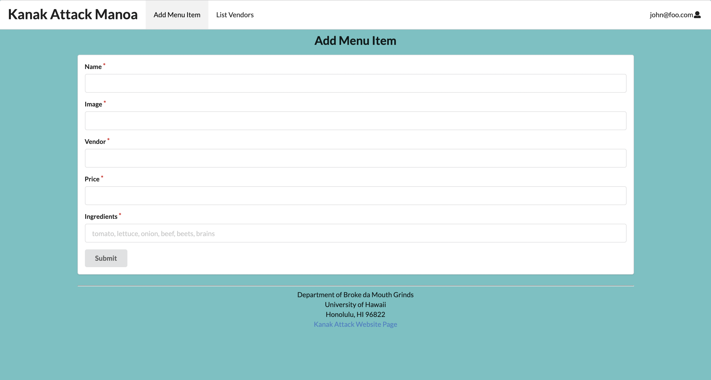

* [Kanak Attack Manoa Organization](https://github.com/kanak-attack-manoa)
* [Kanak Attack Manoa](https://github.com/kanak-attack-manoa/kanak-attack-manoa)
* [M2 Project Board](https://github.com/kanak-attack-manoa/kanak-attack-manoa/projects/2)
* [M1 Project Board](https://github.com/kanak-attack-manoa/kanak-attack-manoa/projects/1)

## Table of contents   
* [Team Members](#team-members)
* [Overview](#overview)
* [User Guide](#user-guide)

## Team Members
* Nicholas Carr 
  * [Portfolio](https://nicholasbcarr.github.io/)
* Jeanne Chan
  * [Portfolio](https://jeanne8879.github.io/)
* Gavin Hirai
  * [Portfolio](https://gavinh123.github.io/)
* Desmond Lum
  * [Portfolio](https://lumd2000.github.io/)
* Tricia Marie Reyes
  * [Portfolio](https://triciamarier.github.io/)

## Overview

Kanak Attack is an app designed for the UH Manoa campus. It gives vendors the ability to maintain an active menu, update special items, and list the availability of items. The items can be sorted by ingredients, cuisine, or availability. The user will have the ability to select what type of cuisine they want. On top of that, they will be able to filter food items by ingredients, type, style. The overall purpose of this app is to display available items around campus so the user can make a decision on what to eat based on their personal taste and availability.

The system should eventually provide the following:

* We will have three user roles (vendor, consumer, and admin) in which the vendors can update the app to include available menu options, changes, or specials.
* Top-level index pages Profiles, Foods, and Places.
* Initialization code to define default Profiles, Foods, and Places and relations between them.
* A simple Filter page where the user will be able to filter the menu items based on their specified food styles.
* We will have certain pages that are public, Profiles, Foods, and Places, while other pages require login, Favorites and  Filter.

## User Guide

This is a user guide for Kanak Attack Manoa and the mockup pages we plan to create.

### Landing Page

When arriving at the landing page, the user has the option to login to an existing account or create a new one. We will also display general information about the app in case the user is contemplating downloading it.

### Index pages (Profiles, Foods, Places)

Kanak Attack provides three public pages that present the contents of the database organized in various ways.

The Profiles page shows all the current defined profiles and their associated Foods and Places:

Mockup of Landing Page:

List Vendor Page:

Mockup of User Page:

Mockup of Login Page:

Mockup of Signup/Register Page:

Example of the admin page:

### Home page

After logging in, you are taken to the home page, which presents a form where you can complete and/or update your personal profile as a vendor or a consumer.

### Add Menu Item

Once a vendor is logged in, the vendor can define new menu items with the Add Menu Item page.

### Filter page

The Filter page provides the ability to query the database and display the results in the page. In this case, the query displays all of the Menu items that match one or more of the specified Food Type(s) (i.e. ingredients, styles, etc..).

### Student/Vendor Feedback

We are undecided on how or if we want to implement community feedback on a vendor basis, application basis or both.

